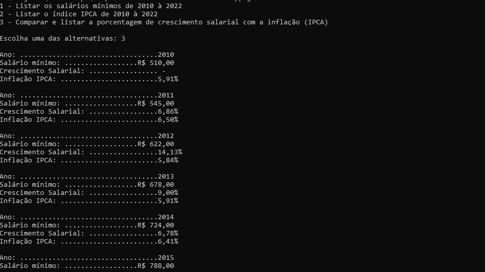

# 🟡 App de Comparação do Crescimento Salarial no Brasil
 
 ### Este é um projeto que mostra uma comparação entre o crescimento salarial no decorrer dos anos no Brasil e a inflação.
 
 ### **🛠️ Feito com:**
  🏷**JavaScript**
  <br>🏷**Node.js**
  <br>🏷 **readline-sync**
 
 ### 📌 Ao rodar esse projeto você consegue visualizar:
 - Lista dos salários mínimos nos últimos anos
 - O Índice de preços do consumidor (IPCA) de acordo com a inflação
 - O percentual crescimento salarial no decorrer dos anos
 
### 🔧 Como rodar
1. Extrair projeto em um diretório 
2. Com o Node.js instalado digitar ```npm i``` no cmd para instalar as dependências do projeto
3. Na pasta do projeto digita ```node app.js``` para executá-lo


